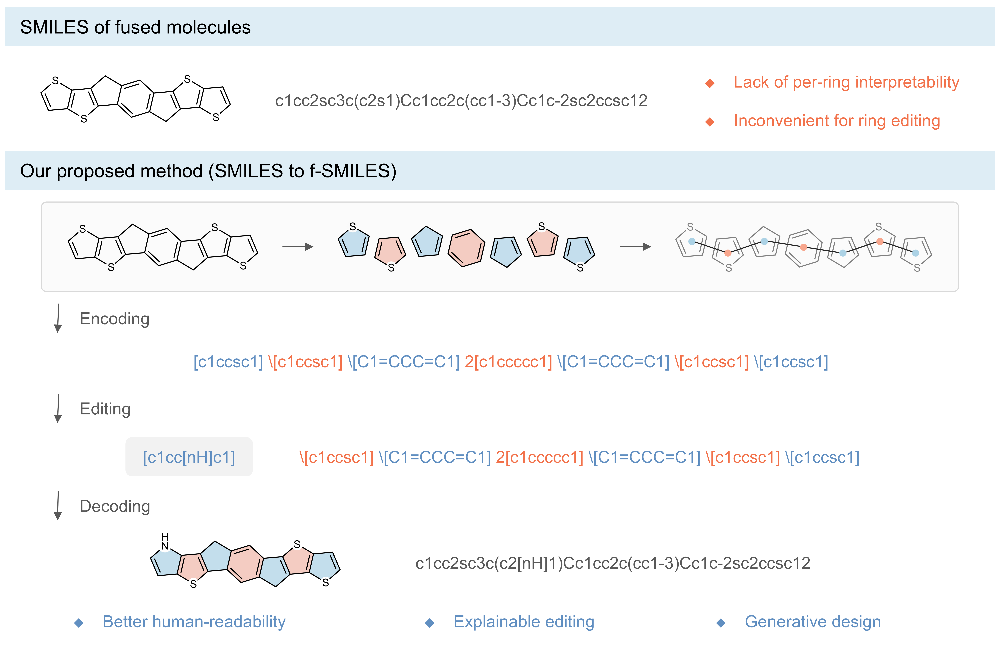
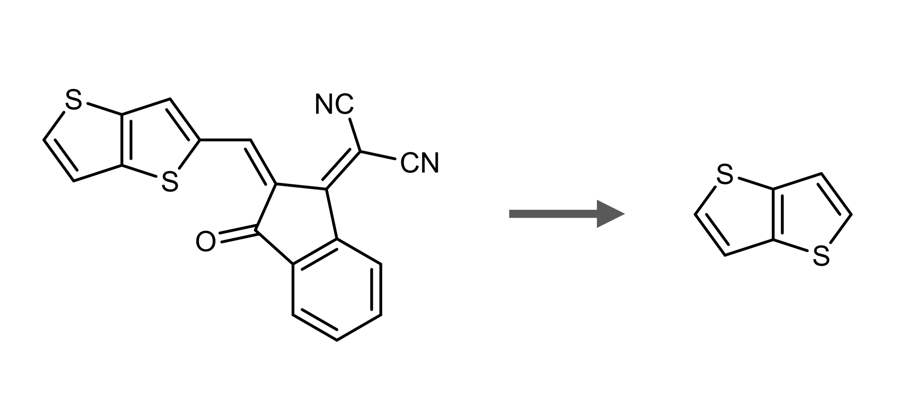

[]([https://github.com/siqins/SymDOR/main/LICENSE](https://github.com/siqins/SymDOR/main/LICENSE))


[//]: # (![DOI]&#40;https://img.shields.io/badge/DOI-10.1038/s43588--025--00903--9-purple&#41;)
# Learning fused molecules with a ring-based chemical language

<div align="center">
  <strong>
    | <a href="#-brief-introduction">Brief introduction</a> |
    <a href="#-project-structure">Project Structure</a> |
    <a href="#-dependencies">Dependencies</a> |
    <a href="#-quick-start">Quick start</a> |
    <a href="#-citation">Citation</a> |
  </strong>
</div>

## 📌 Brief introduction
We propose **f-SMILES**, a novel linear notations that decomposes fused molecules into individual ring units and explicitly encodes their interconnection patterns.

1. **A ring‑based chemical language for fused molecules.** Unlike conventional line notations such as SMILES, f‑SMILES adopts each ring as its fundamental unit and explicitly encodes connectivity patterns between adjacent rings. This design incorporates a coarse‑graining prior, aligning the learning process with domain knowledge of fused molecular structures.
2. **Direct generation without model training.** f‑SMILES enables the direct construction of novel fused molecules, entirely bypassing the need for model training. This capability provides an efficient solution for exploring structurally novel fused systems.
3. **State‑of‑the‑art performance across four core tasks.** f‑SMILES outperforms existing sequence representations in distribution learning, goal‑oriented generation, property prediction, and molecular representation learning for fused molecules. While retaining the computational efficiency of sequence‑based models, it achieves generative and predictive performance comparable to that of baseline graph‑based methods.
4. **Substantial computational efficiency.** f‑SMILES compresses the maximum sequence length, dramatically reducing the computational complexity of the self‑attention mechanism in transformer‑based models and thereby lowering overall computational costs.

<div align=center>


</div>

## 📖 Project Structure
The major folders and their functions in f-SMILES are organized as follows:
```
├── src/                            # Core implementation (including pretraining)
│   ├── baselines/                  # Baseline models and methods
│       ├── generative_models/      # Baseline generative models
│       ├── predictive_models/      # Baseline predictive models
│       └── sequence/               # Baseline linear notations of molecules
│   ├── fSMILES/                    # Source code of f-SMILES
│   ├── simulations/                # Simulation
│   └── utils/                      # Utility functions
├── datasets/                       # Raw and processed dataset files
└── scripts/                        # Scripts for launching training and evaluation
```

## ⚙ Dependencies
We recommend Anaconda to manage the version of Python and installed packages.
Please make sure the following packages are installed, and the installation time is near 10-15 minutes:
```
python          version == 3.9
numpy           version == 1.23.5
pandas          version == 2.3.1
matplotlib      version == 3.9.4
scipy           version == 1.14.0
scikit-learn    version == 1.6.1
networkx        version == 2.8.8
pytorch         version == 2.1.0
rdkit           version == 2023.3.2
joblib          version == 1.5.1
tqdm            version == 4.67.1
pyyaml          version == 6.0.3
```

## 🔑 Quick start
This section provides examples for direct usage of **f-SMILES** and instructions of **scripts**.

### Usage of f-SMILES
To leverage **f-smiles** for fused molecules, run:
```python
from src.fSMILES import SmilesFromFSmiles, SmilesToFSmiles, FSmilesToTokens

# The molecule below is the one on the figure in the brief introduction.
smi = 'c1cc2sc3c(c2s1)Cc1cc2c(cc1-3)Cc1c-2sc2ccsc12'
fsmi = SmilesToFSmiles(smi)
print(fsmi)
# [c1ccsc1]\[c1ccsc1]\[C1=CCC=C1]2[c1ccccc1]\[C1=CCC=C1]\[c1ccsc1]\[c1ccsc1]

# When unit_level is set False, the pair-encoding approach will be used.
tokens = FSmilesToTokens(fsmi, unit_level=True)
print(tokens)
# ['[c1ccsc1]', '\\[c1ccsc1]', '\\[C1=CCC=C1]', '2[c1ccccc1]', '\\[C1=CCC=C1]', '\\[c1ccsc1]', '\\[c1ccsc1]']

smi = SmilesFromFSmiles(fsmi)
print(smi)
# c1cc2sc3c(c2s1)Cc1cc2c(cc1-3)Cc1c-2sc2ccsc12
```
In addition, a function to extract the fused core part of molecules is also provided as follows:
```python
from src.fSMILES import PureCoreSmilesFromSmiles

smi = 'O=C(C1=C(C/2=C(C#N)/C#N)C=CC=C1)C2=C/c3cc4sccc4s3'
core = PureCoreSmilesFromSmiles(smi)
print(core)
# c1cc2sccc2s1
```
> The above transformation of molecules are shown below:
> <div align=center>
> 
> </div>

When a batch of molecules in f-SMILES formats needs to be transformed to SMILES format, a function for batches is recommended:
```python
from src.fSMILES import BatchSmilesFromFSmiles

fsmis = [...]
smis = BatchSmilesFromFSmiles(fsmis)
# return a list of transformed SMILES
```

### Download trained checkpoints (Optional)
The trained models can be downloaded from [link](https://zenodo.org/records/18873932). You can create the target directory to store the trained models if you want to use them:
```
mkdir -p experiments
```

### Preparation of dataset (Optional)
The raw dataset is the file [`fused_units.csv`](datasets/fused_units.csv), the dataset for distribution learning and representation learning is the file [`fused_units_generated.csv`](datasets/fused_units_generated.csv), and the dataset for goal-oriented generation is the file [`fused_units_generated_calculated.csv`](datasets/fused_units_generated_calculated.csv).

If you want to organize dataset by yourself, you can run the script [`molecule_reconstruction.py`](scripts/molecule_reconstruction.py) and use the function prepare_generated_mol_dataset(). The file [`fused_units_generated.csv`](datasets/fused_units_generated.csv) will then be saved. The scripts in the directory [`src/simulations`](src/simulations) are utilized to generate the file [`fused_units_generated_calculated.csv`](datasets/fused_units_generated_calculated.csv).

### Instruction of scripts
This option allows you to use the **scripts**, and all commands in this section are assumed to be run within the [`scripts`](scripts) directory. The calculated results will be saved in the [`experiments`](experiments) directory.
#### Molecule reconstruction
The script [`molecule_reconstruction.py`](scripts/molecule_reconstruction.py) is used for reconstruction and enumeration of molecules via combination of obtained tokens.

#### Distribution learning
The script [`molgpt_training.py`](scripts/molgpt_training.py) is used for distribution learning of fused molecules based on various molecular sequence methods, and the script [`molgpt_evaluation_distribution_learning.py`](scripts/molgpt_evaluation_distribution_learning.py) is used to evaluate the results of generated molecules.

In the script [`molgpt_training.py`](scripts/molgpt_training.py), the dataset is first preprocessed to obtain alphabet of tokens and tokenized sequences, and the results will be saved in the [`experiments`]() directory. Various epochs can be set in model training and inference, and then the script [`molgpt_evaluation_distribution_learning.py`](scripts/molgpt_evaluation_distribution_learning.py) can be employed to evaluate the generative results on different epochs for different sequence methods.

#### Evaluation of baseline generative models
The script [`baseline_generation_models_evaluation.py`](scripts/baseline_generation_models_evaluation.py) is used to evaluate various baseline generative models, including only model inference.

> For baseline model training, the [`tune.py`]() scripts in the corresponding directory of generative models ([`src/baselines/generative_models`](src/baselines/generative_models)) are used for training and inference, the results of generated molecules are then applied for evaluation.

#### Property prediction 
The script [`sequence_prediction_task.py`](scripts/sequence_prediction_task.py) is used for property prediction on various molecular sequence methods.

#### Evaluation of baseline predictive models
The script [`baseline_prediction_models_evaluation.py`](scripts/baseline_prediction_models_evaluation.py) is used to evaluate various baseline predictive models, including model training and inference.

#### Goal-oriented generation
The script [`molgpt_training.py`](scripts/molgpt_training.py) is also used for goal-oriented generation of fused molecules, and the script [`molgpt_evaluation_distribution_learning.py`](scripts/molgpt_evaluation_goal_oriented_generation.py) is used to evaluate the results of generated molecules.
> For evaluation of generated molecules, the AttentiveFP models trained in the section Property Prediction are necessary. The trained models will be saved in the directory [`experiments\prediction_baselines\property\0`]() and need to be renamed as 'model_0.pt' manually.

#### Molecular representation learning
The script [`representation_learning.py`](scripts/representation_learning.py) is used for molecular representation learning on various molecular sequence methods through masked language modeling.


## ⚓ Citation
If you find f-SMILES helpful, please cite our work. (The official paper will be available soon.)